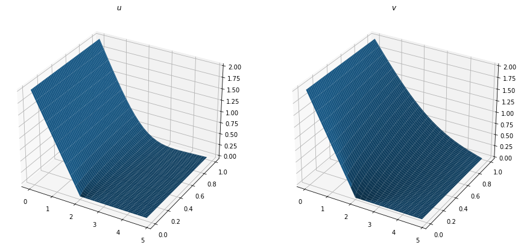
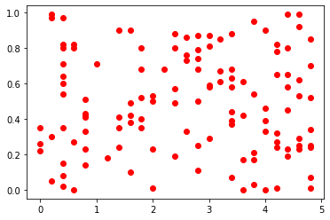
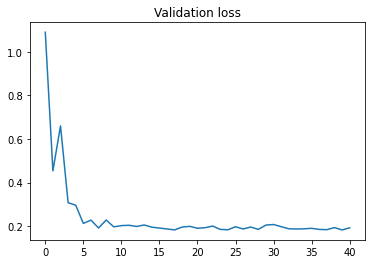
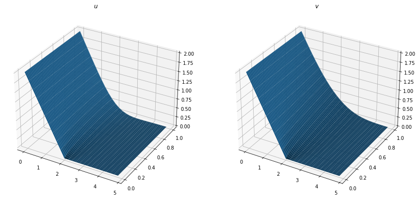

```python
from direct_problem import Grid, ToyProblem, CSFTSolver
from inverse_problem.inverse_problem import fit
from data import RandomCoordinates, RandomParameters, DataGenerator
from plotter.plot import plot_solutions_of_direct_toy_problem
import numpy as np
import torch
from inverse_problem.inverse_problem import get_optimized_model
import matplotlib.pyplot as plt

```


```latex
$$\int_{a}^{b}f(x)dx$$

```


```python
grid = Grid(
    x_min=0,
    x_max=5,
    delta_x=0.2,
    t_max=1,
    delta_t=0.01
)

grid_size = grid.size

```


```python
alpha = 0.4
beta = 1.7
a = 0.4
b = 0.26

def solution_at_t_equal_zero(x): return np.maximum(2-x, 0)

real_problem = ToyProblem(
    alpha,
    beta,
    a,
    b,
    solution_at_t_equal_zero)

fig = plot_solutions_of_direct_toy_problem(
    real_problem, 
    grid)


```


    

    


```python
sample_size = grid_size // 20
coordinates = RandomCoordinates(grid, sample_size)
X, T = coordinates.X, coordinates.T 
plt.scatter(X, T, c='r')
solver = CSFTSolver(real_problem)
u, v = solver.solve()

u_observed = torch.tensor(np.array([
    u[grid.index_of_x(x), grid.index_of_t(t)]for x, t in zip(X, T)
]))


```


    

    


```python
dim = 2
numbers_of_problems = 500

parameters = RandomParameters(numbers_of_problems, dim)
```


```python
data_generator = DataGenerator(
    coordinates,
    parameters,
    solution_at_t_equal_zero)

BATCH_SIZE = 30

u = data_generator.generate_data()
batch_size = 50
train_dl, test_dl = data_generator.dataloader(batch_size)


```


```python
model, opt = get_optimized_model(sample_size)
epochs = 40


loss_array = fit(model, train_dl, test_dl, epochs=epochs, opt=opt)
plt.plot(loss_array)
plt.title("Validation loss")
```

    Average validation loss before fit: 1.0890960693359375
    Average validation loss: 0.19256356358528137


    Text(0.5, 1.0, 'Validation loss')


    

    


```python
r_parameters = model(u_observed).detach().numpy()
r_problem = ToyProblem(
    r_parameters[0],
    r_parameters[1],
    r_parameters[2],
    r_parameters[3],
    solution_at_t_equal_zero)

r_problem.set_grid(grid)
r_problem.init_boundaries()

r_solver = CSFTSolver(r_problem)
u_r, v_r = r_solver.solve()

plot_solutions_of_direct_toy_problem(
    r_problem, grid)
```


    

    

